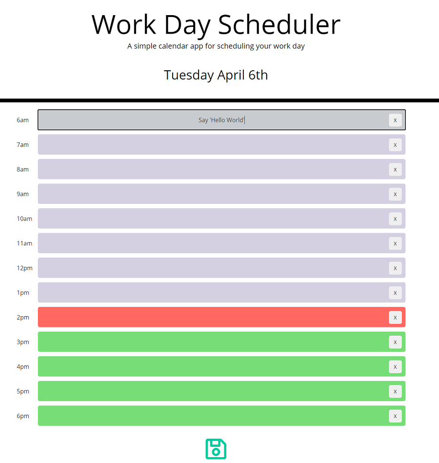

# Work Day Scheduler

## Client Requirements
- This project involved creating a day planner with HTML, CSS/Bootstrap, and JQuery. It allows users to create a schedule for their day, and save the plan in local storage so that it persists upon refreshing the page.

- This project implements third party APIs such as Bootstrap, JQuery and Moment.js in order to provide streamlined development and a great user experience.

- Time-blocks are dynamically updated with moment.js to display past, present and future events and the current day is always displayed at the top of the page.

## Deployment  
- This Project has been deployed to Github and is live on Github pages.  

- This is the link to the deployed webpage: https://brett-treweek.github.io/Everyday-Planner/.

- This is the link to the Github Repository tha contains the code: https://github.com/brett-treweek/Everyday-Planner